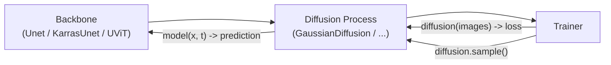

# Architecture Overview

`denoising-diffusion-pytorch` (a.k.a. **x-DDPM**) is a modular toolkit that
implements Denoising Diffusion Probabilistic Models and a large family of their
descendants. This document gives a bird's-eye view of how the package is
structured; see [`core_components.md`](./core_components.md) for the building
blocks and [`model_inference_flow.md`](./model_inference_flow.md) for the
generation pipelines.

## The three-layer design

Almost every model in this repo is assembled from three composable layers. You
pick one piece from each layer and wire them together:

```
┌─────────────────────────────────────────────────────────────┐
│  Layer 3 — TRAINER          (optimisation / EMA / sampling)  │
│    Trainer, Trainer1D                                        │
├─────────────────────────────────────────────────────────────┤
│  Layer 2 — DIFFUSION PROCESS (forward q / reverse p / loss)  │
│    GaussianDiffusion, ElucidatedDiffusion,                   │
│    ContinuousTimeGaussianDiffusion, LearnedGaussianDiffusion │
├─────────────────────────────────────────────────────────────┤
│  Layer 1 — BACKBONE          (noise-predicting network)      │
│    Unet, KarrasUnet, UViT, Unet1D, KarrasUnet3D              │
└─────────────────────────────────────────────────────────────┘
```

- **Layer 1 — Backbone.** A neural network that, given a noisy input and a
  conditioning signal (timestep / noise level, optional class), predicts the
  quantity the diffusion process needs (noise `ε`, clean image `x0`, velocity
  `v`, or a denoised image `D`). The backbone knows nothing about the diffusion
  math.
- **Layer 2 — Diffusion process.** Owns the forward noising schedule `q`, the
  reverse/denoising step `p`, the training objective, and the sampler. It calls
  the backbone once per step. Swapping this layer is how you move between
  DDPM, EDM, continuous-time, learned-variance, etc.
- **Layer 3 — Trainer.** A convenience training loop: data loading, optimiser,
  EMA, mixed precision (via `accelerate`), checkpointing, periodic sampling, and
  optional FID evaluation.

The canonical call structure is:



```python
model     = Unet(dim = 64, dim_mults = (1, 2, 4, 8))
diffusion = GaussianDiffusion(model, image_size = 128, timesteps = 1000)
trainer   = Trainer(diffusion, 'path/to/images')
trainer.train()
```

## Module map

| File | Layer | What it provides |
|------|-------|------------------|
| `denoising_diffusion_pytorch.py` | 1+2+3 | The reference 2D stack: `Unet`, `GaussianDiffusion` (DDPM + DDIM), `Trainer`, `Dataset`. The other modules are variations on this one. |
| `denoising_diffusion_pytorch_1d.py` | 1+2+3 | 1D analogue (`Unet1D`, `GaussianDiffusion1D`, `Trainer1D`, `Dataset1D`) for sequences / time series / audio. |
| `attend.py` | — | `Attend`: attention backend that dispatches to PyTorch 2.0 flash / mem-efficient / math SDPA kernels. |
| `classifier_free_guidance.py` | 1+2 | Class-conditioned `Unet` + `GaussianDiffusion` with **classifier-free guidance** (null-embedding dropout, guidance scale, std-rescale, CFG++). |
| `guided_diffusion.py` | 2 | **Classifier guidance** (gradient guidance from a separate noise-aware classifier). |
| `elucidated_diffusion.py` | 2 | **EDM** (Karras et al. 2022): continuous-σ preconditioning, Heun sampler with churn, and a **DPM-Solver++** sampler. |
| `continuous_time_gaussian_diffusion.py` | 2 | Continuous-time (VDM-style) diffusion parameterised by **log-SNR**; linear/cosine/learned schedules. |
| `v_param_continuous_time_gaussian_diffusion.py` | 2 | The continuous-time model with **v-parameterisation**. |
| `learned_gaussian_diffusion.py` | 2 | **Learned variance** (Improved DDPM): hybrid simple + variational-lower-bound loss. |
| `weighted_objective_gaussian_diffusion.py` | 2 | Author's experiment: per-pixel learned blend of `ε`- and `x0`-parameterised predictions. |
| `karras_unet.py` | 1 | **Magnitude-preserving UNet** (EDM2): bias-free, forced weight-norm, MP primitives. + `InvSqrtDecayLRSched`. |
| `karras_unet_1d.py`, `karras_unet_3d.py` | 1 | 1D / 3D magnitude-preserving UNets. |
| `simple_diffusion.py` | 1+2 | **Simple Diffusion** (Hoogeboom et al. 2023): `UViT` backbone + resolution-dependent log-SNR schedule shift. |
| `repaint.py` | 2 | **RePaint** inpainting: mask-blend reverse step + resampling. |
| `fid_evaluation.py` | — | `FIDEvaluation`: Inception features + Fréchet distance for sample-quality tracking. |
| `version.py` | — | Package version string. |

## Dimensionality

The same ideas are provided for several data ranks:

- **2D** (`...pytorch.py`, `karras_unet.py`, `simple_diffusion.py`) — images.
- **1D** (`...pytorch_1d.py`, `karras_unet_1d.py`) — waveforms, time series.
- **3D** (`karras_unet_3d.py`) — video / volumetric data.

## Configuration knobs that cut across modules

These appear in many of the `GaussianDiffusion`-style classes and are the main
way you tune behaviour without changing modules:

- **`objective`** — `pred_noise` | `pred_x0` | `pred_v` (default `pred_v` in
  this fork's 2D model). Chooses what the backbone regresses.
- **`beta_schedule`** — `linear` | `cosine` | `sigmoid`. The discrete noise
  schedule; the continuous-time modules use log-SNR schedules instead.
- **`timesteps` vs `sampling_timesteps`** — training horizon vs inference
  horizon. Setting `sampling_timesteps < timesteps` switches the sampler to
  **DDIM** for fast few-step generation.
- **`ddim_sampling_eta`** — `0` deterministic DDIM ↔ `1` stochastic (DDPM-like).
- **`min_snr_loss_weight` / `min_snr_gamma`** — min-SNR loss weighting
  (down-weights low-noise timesteps).
- **`offset_noise_strength`**, **`immiscible`** — sample-quality tricks.

## Design philosophy

The package is deliberately a **menu, not a framework**. Each diffusion variant
is a self-contained file that subclasses or mirrors the reference
`GaussianDiffusion`, so you can read any one module top-to-bottom without
chasing abstractions, and you can mix a backbone from one paper with a process
from another. The cost of that is some duplication (`q_sample`, helper
functions, and the sampler skeleton recur across files); the benefit is that
each file is a complete, studyable implementation of one idea.
