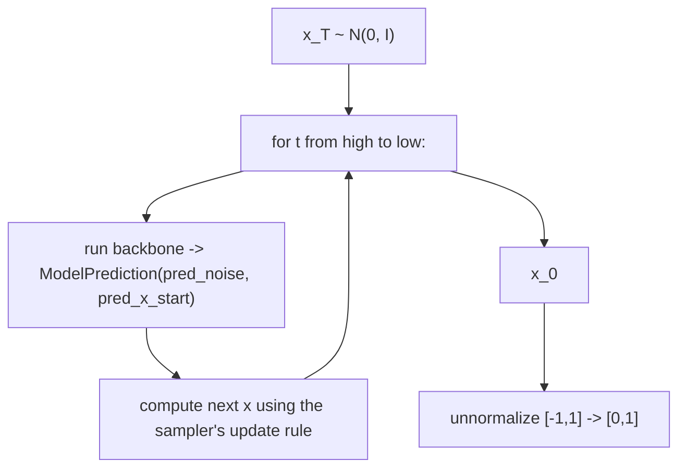
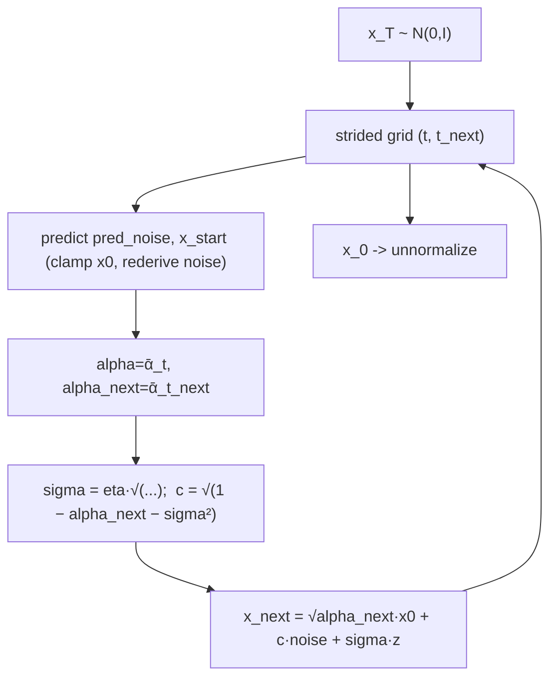

# Model Inference Flow

How samples are generated. Every sampler starts from noise and iteratively
denoises, but the modules differ in the integrator, the time parameterisation,
and any conditioning. See [`core_components.md`](./core_components.md) for the
classes referenced here.

## The common shape of a reverse process



The key shared idea: the backbone is always reduced to an `(ε, x0)` pair by
`model_predictions`, and each sampler turns that pair into the next state.

## 1. DDPM ancestral sampling — `p_sample_loop`

The original Markov-chain sampler. For every integer timestep `t = T-1 … 0`:

1. `p_mean_variance` → posterior mean/variance from the predicted `x0`.
2. `x_{t-1} = mean + σ_t · z`, with `z ~ N(0, I)` (and **no** noise at `t = 0`).

Runs all `timesteps` (≈1000) steps. Highest fidelity, slowest.

## 2. DDIM — `ddim_sample`

A non-Markovian sampler that allows **far fewer steps** (`sampling_timesteps`).
For each consecutive pair `(t, t_next)` on a strided time grid:

```
x_{t_next} = √ᾱ_{t_next} · x̂0  +  √(1 − ᾱ_{t_next} − σ²) · ε̂  +  σ · z
σ = η · √[ (1 − ᾱ_t/ᾱ_{t_next}) · (1 − ᾱ_{t_next}) / (1 − ᾱ_t) ]
```

- `η = 0` (`ddim_sampling_eta`, default) → deterministic ODE, reproducible,
  few-step friendly.
- `η = 1` with the full grid → recovers DDPM.
- `x̂0` is clamped and `ε̂` re-derived from it for consistency.



`sample()` dispatches to `p_sample_loop` or `ddim_sample` based on
`is_ddim_sampling = sampling_timesteps < timesteps`.

## 3. EDM — Heun sampler with churn (`elucidated_diffusion.py`)

EDM works in continuous noise level `σ` rather than discrete `t`.

1. Build a ρ-warped σ schedule `[σ_max … σ_min, 0]`.
2. Per step, optionally **churn**: raise σ → σ̂ by injecting fresh noise
   (`S_churn`, `S_noise`, within `[S_tmin, S_tmax]`).
3. **Predictor** (Euler) using the denoiser `D_θ`:
   `d = (x − D_θ)/σ̂`, `x_next = x̂ + (σ_next − σ̂)·d`.
4. **Corrector** (Heun 2nd order), unless last step:
   re-evaluate `D_θ` at `x_next` and average the two derivatives.

`S_churn = 0` → deterministic Heun ODE. The denoiser is the preconditioned
network `c_skip·x + c_out·F_θ(c_in·x, c_noise(σ))`.

## 4. DPM-Solver++ — `sample_using_dpmpp` (`elucidated_diffusion.py`)

> Note: DPM-Solver++ lives in the **EDM** module, not in the main DDPM file.

A fast multistep (2M) solver in log-SNR space `t = −log σ`:

```
x_next = (σ(t_next)/σ(t))·x − (e^{−h} − 1)·denoised_d
```

where `denoised_d` blends the current and previous denoised estimates
(`γ = −1/(2r)`, `r = h_last/h`) for second-order accuracy; the first/last steps
fall back to first order. Achieves high quality in ~10–20 steps.

## 5. Continuous-time sampling (`continuous_time_gaussian_diffusion.py`)

Time is real `t ∈ [0,1]`; the number of sampling steps is chosen freely via
`linspace(1, 0, N+1)` and is decoupled from training. Each step:

```
c = 1 − exp(logSNR(t) − logSNR(t_next))
μ = α_next · [ x·(1−c)/α + c·x̂0 ]
Σ = σ²_next · c
```

with `α = √sigmoid(logSNR)`, `σ = √sigmoid(−logSNR)`. The ε-model recovers
`x̂0 = (x − σ·ε_θ)/α`; the v-model recovers `x̂0 = α·x − σ·v`.

## 6. Classifier-Free Guidance (`classifier_free_guidance.py`)

At inference the class-conditioned `Unet` is evaluated twice — once with the
real class embedding, once with the learned null embedding — and combined:

```
out = uncond + cond_scale · (cond − uncond)
```

Optional **std-rescale** (`rescaled_phi`) counters over-saturation at high
scales; **CFG++** renoises with the unconditional score to stay on the data
manifold. No separate classifier is needed.

## 7. Classifier Guidance (`guided_diffusion.py`)

Uses a **separate** noise-aware classifier. At each step the reverse mean is
shifted along the classifier gradient:

```
μ' = μ + σ² · ∇_x log p(y | x_t)
```

More expensive (extra network) and generally lower quality than CFG; not
supported under DDIM here.

## 8. RePaint inpainting (`repaint.py`)

Given a ground-truth image `gt` and a binary `mask` (1 = known), each reverse
step blends a forward-noised known region with the model-denoised unknown
region:

```
x̃_t = mask ⊙ (√ᾱ_t·gt + √(1−ᾱ_t)·ε)  +  (1 − mask) ⊙ x_t
x_{t-1} = p_θ(x̃_t)         # standard reverse step on the blend
```

A **resampling** ("jump back") loop periodically re-noises and re-denoises to
harmonise the boundary between known and unknown regions. (This fork uses a
simplified inline resampling, not the paper's `get_schedule_jump` schedule.)

## Sampler selection cheat-sheet

| Want | Use |
|------|-----|
| Best fidelity, no time budget | DDPM `p_sample_loop` |
| Fast deterministic few-step | DDIM (`sampling_timesteps < timesteps`, `eta=0`) |
| State-of-the-art quality/steps | EDM Heun or DPM-Solver++ (`ElucidatedDiffusion`) |
| Arbitrary step count, learnable schedule | `ContinuousTimeGaussianDiffusion` |
| Class-conditional generation | `classifier_free_guidance.py` |
| Inpainting | `repaint.py` |
